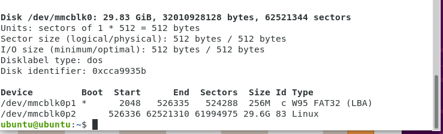
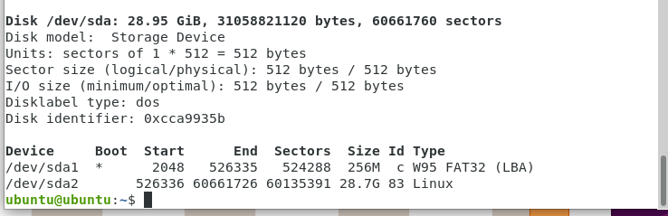
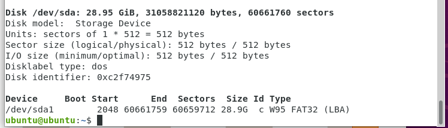
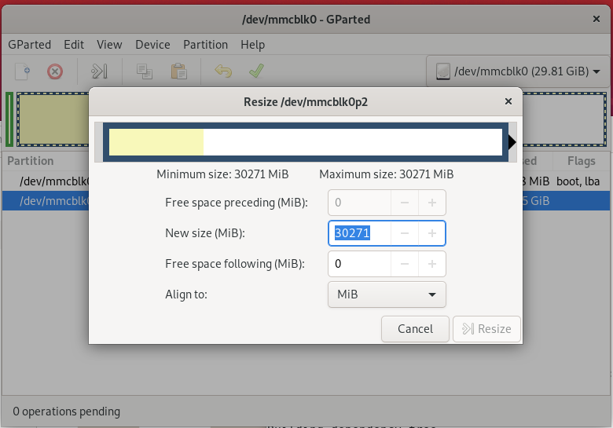
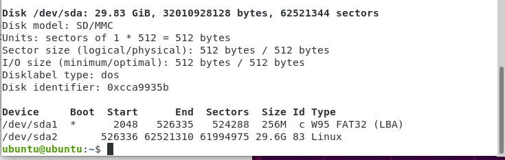
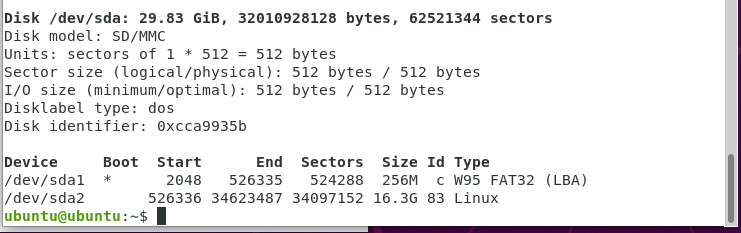

###バックアップ
~~~  
sudo fdisk -l
~~~

  

/dev/mmcblk0にラズパイ環境が入っている  
sdカードを接続  

  

/dev/sdaにマウントされていることがわかる  
FAT32にフォーマットする  

  

FAT32にフォーマットされていることが確認できる  

~~~ 
#bs=1Mこれでは遅いかも
sudo dd if=/dev/mmcblk0 bs=10M | gzip > /home/ubuntu/ubuntubackup_202103.gz
gzip -dc /home/ubuntu/ubuntubackup_202103.gz | sudo dd bs=10M of=/dev/sda status=progress
#こちらで実行
sudo dd if=/dev/mmcblk0 bs=10M of=/dev/sda status=progress
~~~
ソースカードのパーティション縮小  
~~~ 
sudo apt-get install gparted
sudo apt install gparted
~~~
gpartedを起動  
アンマウントしてリサイズをする  
  

書き込みをする前に、SDカードをアンマウントする必要があります  
~~~ 
df -h
umount dev/sda2
sudo dd if=/dev/mmcblk0 bs=10M of=/dev/sda2 status=progress
sync
~~~
やり方を変える  
まずは先に外付けHDDにデータを保存  

~~~ 
sudo fdisk -l
#mmcblk0ここにラズパイ情報が入っているsdaが外付けハード
sudo dd if=/dev/mmcblk0 bs=20M of=/dev/sda status=progress

~~~
起動用sdカードを使用しバックアップｓｄカードを操作する
~~~ 
sudo fdisk -l
~~~
  
gpartedを利用してパーテーションを縮小してapply 

  
gpartedを利用別sdに保存するとラズパイが使えるようになる。

