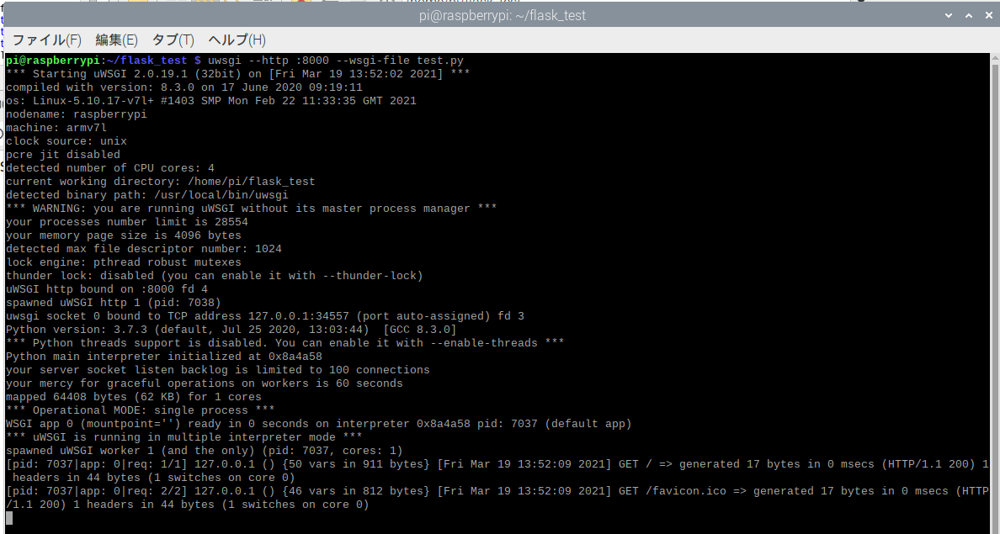
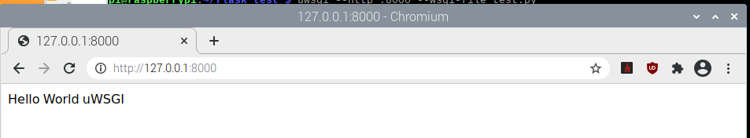
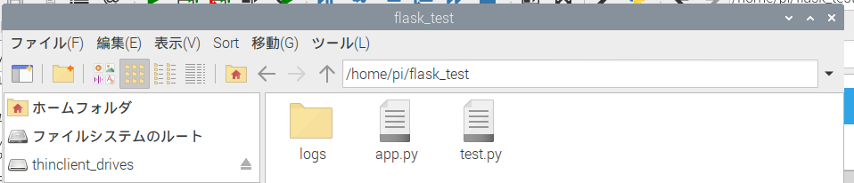
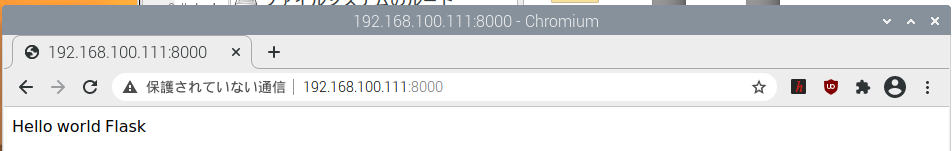
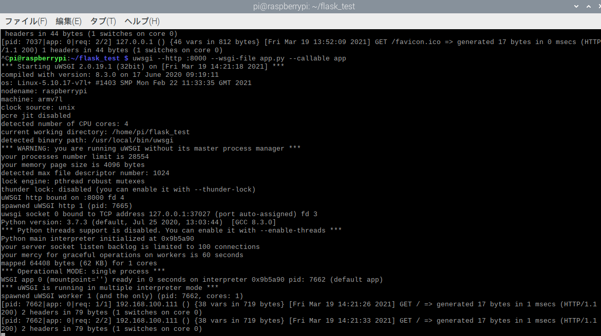

# flask設定
/home/piにflask_testというディレクトリを作成する。
下記のものをインストールしておく
~~~  
sudo pip3 install Flask==1.1.2
sudo pip3 install　opencv-python==4.3.0.38 #うまくいかない
sudo pip3 install bokeh==0.13.0
sudo apt install libopencv-dev python3-opencv#これでうまくいった
sudo pip3 install uwsgi
~~~
## uWSGIの動作確認をする
ディレクトリに下記のファイルを置く
test.py

~~~ 
def application(env, start_response):
    start_response('200 OK', [('Content-Type','text/html')])
    return
~~~
下記コマンドで実行
~~~ 
uwsgi --http :8000 --wsgi-file test.py
~~~
    
    

## Flaskの組み込みサーバーでHelloWorldを表示する
ディレクトリに下記のファイルを置く
またログを残すようにしているので、logsのいうディレクトリを作っておく
  


app.py
~~~python
from flask import Flask
import logging
from logging.handlers import TimedRotatingFileHandler
app = Flask(__name__)

@app.route("/")
def hello():
    return "Hello world Flask"

if __name__ == "__main__":
    #rootロガーを取得
    logger = logging.getLogger()
    logger.setLevel(logging.DEBUG)
    #出力のフォーマットを定義
    formatter = logging.Formatter('%(asctime)s - %(levelname)s - %(message)s')
    #ファイルへ出力するハンドラーを定義
    #when='D','H','M'
    fh=logging.handlers.TimedRotatingFileHandler(filename='logs/log.txt',
                                                 when='D',
                                                 backupCount=7)
    fh.setLevel(logging.DEBUG)
    fh.setFormatter(formatter)
    #rootロガーにハンドラーを登録する
    logger.addHandler(fh)

    #app.run(host='127.0.0.1', port=8000,threaded=True)
    app.run(host='192.168.100.111', port=8000,threaded=True)
~~~
  

##uWSGIを通してFlaskのサイトをブラウザに表示する
以下のコマンドで実行

~~~
uwsgi --http :8000 --wsgi-file app.py --callable app
~~~
  

ただこのやり方ではログが残せないことが判明。別のやり方を検討

## uWSGIを設定ファイルから実行
myapp.ini

~~~
# uwsgi.ini
 
[uwsgi]
 
# wsgiファイル
wsgi-file=app.py
callable=app

#daemonize = /var/log/uWSGI-@(exec://date +%%Y-%%m-%%d).log
daemonize = /home/pi/flask_test/logs/uWSGI-@(exec://date +%%Y-%%m-%%d).log
log-reopen = true
log-maxsize = 8000000
logfile-chmod = 644
 
# アクセス許可ホスト:ポート
http=192.168.100.111:8000
~~~
下記コマンドで起動させてみる
~~~
uwsgi myapp.ini
~~~
停止させる場合
~~~
ps -aux | grep uwsgi
kill -QUIT
~~~
## Nginxの動作確認をする

~~~
sudo apt install nginx
nginx#これでは起動しなかった
sudo service nginx start#起動成功　http://127.0.0.1:80で確認
sudo nginx -s stop#停止
sudo nginx -s reload#再起動
~~~

http://127.0.0.1:8000にアクセス


設定ファイルの確認/etc/nginx/


/etc/nginx/modules-enabled/*.conf

ここにはdefaultの記述内容が読まれている


/etc/nginx/conf.d/*.conf

/etc/nginx/site-enabled/*.conf

ここも読みに行っている。


## nginxの設定ファイル作成

今回は「/etc/nginx/conf.d/uwsgi.conf」というuWSGIとの連携用ファイルを作成

```
server {
    listen       192.168.100.111:5000;
    location / {
        include uwsgi_params;
        uwsgi_pass unix:///tmp/uwsgi.sock;
    }
}
```

##### server { ~ }

波括弧内に記載されたlisten(後述)やserver_nameで

指定されたサーバーに対する設定を記載するブロック

##### listen

listenの後にある数字がこの設定と対応するポート番号

172.16.0.39:80のようにIPアドレスを指定することが出来IPアドレスが省略された場合にはlocalhostが対象

今回の場合は192.168.100.111:のポート番号50000にアクセスがきた時にlocationブロック内の設定に

したがって情報の処理がされます

##### location

リクエストで送られてきたパスに対応して、nginxがどこに情報を受継げば良いのかを示している

##### include uwsgi_params;

uwsgi_paramsというファイルを読み込んで、
このファイルに記述されている設定を利用出来るようにしています。

##### uwsgi_pass unix:///tmp/uwsgi.sock;

uwsgiへの接続窓口を指定しています。

この記載によって、50000番ポートにアクセスがきた時には、
localhostの/tmp/uwsgi.sock（ソケット,情報の窓口）に処理を引き継ぐことにります。

##### 設定の確認

```
sudo service nginx testconfig
```

## uWSGIの設定ファイルを作成

myapp.ini

デーモン化したuwsgiを停止、リロードするにはpidファイルが必要なので追加#うまくいかなかった？

アクセスは/tmp/uwsgi.sockで行う

```
# uwsgi.ini

[uwsgi]

# wsgiファイル

wsgi-file=app.py
callable=app

# デーモン化
#daemonize = /var/log/uWSGI-@(exec://date +%%Y-%%m-%%d).log
daemonize = /home/pi/flask_test/logs/uWSGI-@(exec://date +%%Y-%%m-%%d).log
log-reopen = true
log-maxsize = 8000000
logfile-chmod = 644
#追加
#pidfile = /var/run/uwsgi/uwsgi.pid
pidfile = /tmp/flask_app.pid

# アクセス許可ホスト:ポート
#http=192.168.100.111:8000
#追加
master = true
processes = 1
socket = /tmp/uwsgi.sock
chmod-socket = 666
vacuum = true
die-on-term = true

```

pidファイル用ディレクトリの作成#うまくいかなかった

```
sudo mkdir /var/run/uwsgi
```

## NginxとuWSGIを接続して、動作確認

uWSGIサーバーを以下のコマンドで立ち上げる

```
uwsgi --ini myapp.ini
ps -aux | grep uwsgi
kill -QUIT#下の場合なら6576と打つ
killall -9 uwsgi#もしくはこちら
uwsgi --stop /var/run/uwsgi/uwsgi.pid#pidファイル作成後はこれでもOK#うまくいかなかった
uwsgi --stop /tmp/flask_app.pid  # 停止
uwsgi --reload /tmp/flask_app.pid  # リロード#うまくいかなかった
```


別のターミナルを開いて、nginxを起動する

```
sudo service nginx start#起動成功　http://127.0.0.1:80で確認
sudo nginx -s stop#停止
systemctl status nginx.service
sudo systemctl daemon-reload
sudo systemctl start nginx.service
sudo systemctl enable nginx.service#起動成功させてからこのコマンドで自動起動する
sudo systemctl disable nginx.service
```

## 自動起動を設定する

uwsgiをsystemctlを用いて、自動起動できるよう設定を行っておく。 systemctlに登録するために、/etc/systemd/system/内にuwsgi.serviceファイルを作る

その為にuwsgiの実行環境はどこかを調べる

私の環境では以下に入っていた


```
sudo vi uwsgi.service
```

```
[Unit]
Description = uWSGI
After = syslog.target
[Service]
User=root
ExecStart = /usr/local/bin/uwsgi --ini /home/pi/flask-test/myapp.ini
Restart=always
KillSignal=SIGQUIT
Type=notify
StandardError=syslog
NotifyAccess=all
[Install]
WantedBy=multi-user.target
```

UnitがServiceとして認識されたか確認

```
sudo systemctl daemon-reload
systemctl
systemctl status uwsgi //status確認
sudo systemctl start uwsgi // uWSGI開始
sudo systemctl stop uwsgi // uWSGI停止
```

