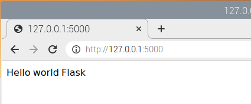

## 1. Pipenvで仮想環境構築する

/home/piにflask_testというディレクトリを作成する。
下記のものをインストールしておく
~~~  
pip3 install --upgrade pip
pip3 install pipenv    # pipenvをインストールする
export PATH=$PATH:/home/pi/.local/bin  # PATHを追加する

mkdir ./flask-test    # flask-testディレクトリを作成
cd ./flask-test    # flask-testディレクトリに移動
pipenv install --python 3.7.3  #3.7.3で仮想環境構築

pipenv install uwsgi    # 仮想環境にuwsgiをインストール
pipenv install flask    # 仮想環境にflaskをインストール
pipenv shell #仮想環境を実行
~~~
## 2. uWSGIの動作確認をする

ディレクトリに下記のファイルを置く
test.py

~~~ 
def application(env, start_response):
    start_response('200 OK', [('Content-Type','text/html')])
    return
~~~
下記コマンドで実行
~~~ 
(flask-test)pi$ uwsgi --http :8000 --wsgi-file test.py    
~~~
## 3. Flaskの組み込みサーバーでHelloWorldを表示する

ディレクトリに下記のファイルを置く


app.py
~~~python
from flask import Flask
app = Flask(__name__)

@app.route("/")
def hello():
    return "Hello world Flask"

if __name__ == "__main__":
    app.run()
~~~
```sh
(flask-test)pi$ python app.py
```

  

## 4. uWSGIを通してFlaskのサイトをブラウザに表示する以下のコマンドで実行

~~~
(flask-test)pi$ uwsgi --http :8000 --wsgi-file app.py --callable app  
~~~
## 5. Nginxの動作確認をする

myapp.ini

~~~
(flask-test) pi $exit    #exitして仮想環境から出る
pi$ sudo apt install nginx
pi$ sudo /etc/init.d/nginx start 
[ ok ] Starting nginx (via systemctl): nginx.service.
sudo apt install nginx
sudo systemctl start nginx
sudo systemctl enable nginx
sudo systemctl stop nginx
systemctl status nginx.service
sudo systemctl daemon-reload
~~~
 http://127.0.0.1:80にアクセス
## 6. Nginxのバーチャルホストの設定を行う

/etc/nginx/nginx.confの確認

設定ファイルの確認/etc/nginx/


sites-availableに設定ファイル実体を配置して、sites-enabledに設定ファイルへの[シンボリックリンク](http://d.hatena.ne.jp/keyword/%A5%B7%A5%F3%A5%DC%A5%EA%A5%C3%A5%AF%A5%EA%A5%F3%A5%AF)を張るのが通例のようだ。

sites-available、sites-enabledのフォルダ直下には、同じdefaultファイルが存在する。コピーを作成して、ファイル名を変更する。


```
$ cd /etc/nginx/sites-available
$ sudo cp default ./app_nginx.conf
```

/var/www/に80番ポートでアクセスしたときに、uWSGIに接続するような設定にする。

```
sudo apt install gedit
sudo su
export DISPLAY=:10.0
export DISPLAY=:0.0
sudo gedit app_nginx.conf
#geditでは編集できなかった
```

```
# Virtual Host configuration for example.com
server {
        listen 80;
        server_name example.com;        
        location / {
          include uwsgi_params;
          uwsgi_pass unix:/tmp/uwsgi.sock;
        }
}
```

シンボリックリンクを設定する。

```
$  cd /etc/nginx/sites-enabled/
$  sudo ln -s /etc/nginx/sites-available/app_nginx.conf app_nginx.conf
```


## 7. uWSGIの設定ファイルを作成する

flask-testフォルダ直下に、myapp.iniを作成

```
[uwsgi]
module = app
callable = app
master = true
processes = 1
socket = /tmp/uwsgi.sock
chmod-socket = 666
vacuum = true
die-on-term = true
#chdir = /home/pi/flask-test  # フォルダのディレクトリを指定する#これがあると動作しなかったので消した
```


## 8.NginxとuWSGIを接続して、動作確認をする

flask-testフォルダ直下で

```
pipenv shell #仮想環境を実行
$ uwsgi --ini myapp.ini
```

nginxを起動

```
sudo systemctl stop nginx
sudo systemctl daemon-reload
sudo systemctl start nginx
```

## 9. 自動起動を設定する

/etc/systemd/system/内にuwsgi.serviceファイルを作る

```
sudo vi uwsgi.service
```


```
[Unit]
Description = uWSGI
After = syslog.target
[Service]
ExecStart = /home/pi/.local/share/virtualenvs/flask-test-B9hguzxm/bin/uwsgi --ini  /home/pi/flask-test/myapp.ini
Restart=always
KillSignal=SIGQUIT
Type=notify
StandardError=syslog
NotifyAccess=all
[Install]
WantedBy=multi-user.target
```

/home/pi/.local/share/virtualenvs/flask-test-B9hguzxm/bin/uwsgi --ini  /home/pi/flask-test/myapp.ini

systemctlのコマンドは以下の通り

```
$ sudo systemctl status uwsgi //status確認
$ sudo systemctl daemon-reload
$ sudo systemctl start uwsgi // uWSGI開始
$ systemctl stop uwsgi // uWSGI停止
```

最初internal server errorが出た

myapp.iniをフルパスにしたらよくなった。

```
[uwsgi]
wsgi-file=/home/pi/flask-test/app.py
callable=app
master = true
processes = 1
socket = /tmp/uwsgi.sock
chmod-socket = 666
vacuum = true
die-on-term = true
#chdir = /home/pi/flask-test  # フォルダのディレクトリを指定する
```


## １０仮想でない環境で再チャレンジ

/home/piにflask_test2というディレクトリを作成する。

```
pip3 install --upgrade pip
sudo pip3 install Flask==1.1.2
sudo pip3 install bokeh==0.13.0
sudo pip3 install uwsgi
```

下記コマンドで実行

```
uwsgi --http :8000 --wsgi-file test.py
```

## １１Flaskの組み込みサーバーでHelloWorldを表示する

app.py

```
from flask import Flask
import logging
from logging.handlers import TimedRotatingFileHandler
app = Flask(__name__)

@app.route("/")
def hello():
    return "Hello world Flask"

if __name__ == "__main__":
    #rootロガーを取得
    logger = logging.getLogger()
    logger.setLevel(logging.DEBUG)
    #出力のフォーマットを定義
    formatter = logging.Formatter('%(asctime)s - %(levelname)s - %(message)s')
    #ファイルへ出力するハンドラーを定義
    #when='D','H','M'
    fh=logging.handlers.TimedRotatingFileHandler(filename='logs/log.txt',
                                                 when='D',
                                                 backupCount=7)
    fh.setLevel(logging.DEBUG)
    fh.setFormatter(formatter)
    #rootロガーにハンドラーを登録する
    logger.addHandler(fh)
    #app.run(host='127.0.0.1', port=8000,threaded=True)
    app.run(host='192.168.100.111', port=8000,threaded=True)
```

以下のコマンドで実行

```sh
python3 app.py
```

http://192.168.100.111:8000/ブラウザで確認

## １２uWSGIを設定ファイルから実行

myapp.ini

```
[uwsgi]

# wsgiファイル

wsgi-file=/home/pi/flask-test2/app.py
callable=app

#daemonize = /var/log/uWSGI-@(exec://date +%%Y-%%m-%%d).log
daemonize = /home/pi/flask-test2/logs/uWSGI-@(exec://date +%%Y-%%m-%%d).log
log-reopen = true
log-maxsize = 8000000
logfile-chmod = 644

# アクセス許可ホスト:ポート

http=192.168.100.111:8000
```

下記コマンドで起動させてみる

```
uwsgi myapp.ini
```

停止させる場合

```
killall -9 uwsgi#もしくはこちら
```

## 13Nginxの動作確認をする

```
sudo apt install nginx
sudo systemctl start nginx
sudo systemctl enable nginx
sudo systemctl stop nginx
systemctl status nginx.service
sudo systemctl daemon-reload
```

## 14nginxの設定ファイル作成

今回は「/etc/nginx/conf.d/uwsgi.conf」というuWSGIとの連携用ファイルを作成

```
sudo vi uwsgi.conf
```

```
server {
    listen       192.168.100.111:5000;
    location / {
        include uwsgi_params;
        uwsgi_pass unix:///tmp/uwsgi.sock;
    }
}
```

設定の確認

sudo service nginx testconfig

## 15uWSGIの設定ファイルを作成

```
[uwsgi]

# wsgiファイル

wsgi-file=/home/pi/flask-test2/app.py
callable=app

#daemonize = /var/log/uWSGI-@(exec://date +%%Y-%%m-%%d).log
daemonize = /home/pi/flask-test2/logs/uWSGI-@(exec://date +%%Y-%%m-%%d).log
log-reopen = true
log-maxsize = 8000000
logfile-chmod = 644
#追加
pidfile = /tmp/flask_app.pid

# アクセス許可ホスト:ポート
#http=192.168.100.111:8000
#追加
master = true
processes = 1
socket = /tmp/uwsgi.sock
chmod-socket = 666
vacuum = true
die-on-term = true
```

## 16NginxとuWSGIを接続して、動作確認

下記のコマンドで動作確認

```
sudo systemctl stop nginx
sudo systemctl daemon-reload
sudo systemctl start nginx
sudo systemctl status nginx
sudo systemctl enable nginx
```

```
/usr/local/bin/uwsgi --ini  /home/pi/flask-test2/myapp.ini
killall -9 uwsgi
/usr/local/bin/uwsgi --http :8000 --wsgi-file /home/pi/flask-test2/test.py
/usr/local/bin/uwsgi --socket /tmp/uwsgi.sock --wsgi-file=/home/pi/flask-test2/app.py --callable app --chmod-socket=666
```

なぜか/etc/nginx/conf.d/uwsgi.confがあるとnginxの自動起動ができなくなったので変更した

/etc/nginx/conf.d/uwsgi.conf

```
server {
    listen       5000;
    location / {
        include uwsgi_params;
        uwsgi_pass unix:///tmp/uwsgi.sock;
    }
}
```

代わりにローカルホストIPを変更した

sudo nano /etc/dhcpcd.conf

```
nterface wlan0
static ip_address=192.168.100.111/24
static routers=192.168.100.1
static domain_name_servers=192.168.100.1
```

ttp://192.168.100.111:5000


```
/usr/local/bin/uwsgi --socket /tmp/uwsgi.sock --wsgi-file=/home/pi/flask-test2/app.py --callable app --chmod-socket=666 
これで動いた
```

```
これで動いた
[uwsgi]
wsgi-file=/home/pi/flask-test2/app.py
callable=app
master = true
processes = 1
socket = /tmp/uwsgi.sock
chmod-socket = 666
vacuum = true
die-on-term = true
#chdir = /home/pi/flask-test  # フォルダのディレクトリを指定する
```

```
/usr/local/bin/uwsgi --ini myapp.ini
/usr/local/bin/uwsgi --ini /home/pi/flask-test2/myapp.ini
```

バックグラウンドで動作させるように下記を追加した

```
これで動いた
[uwsgi]
wsgi-file=/home/pi/flask-test2/app.py
callable=app
master = true
processes = 1
socket = /tmp/uwsgi.sock
chmod-socket = 666
vacuum = true
die-on-term = true
#chdir = /home/pi/flask-test  # フォルダのディレクトリを指定する
#追加ここを入れるとsystemctlで動かない
daemonize = /home/pi/flask-test2/logs/uWSGI-@(exec://date +%%Y-%%m-%%d).log#これがダメ
#logto = /home/pi/flask-test2/logs/uWSGI-@(exec://date +%%Y-%%m-%%d).log
log-reopen = true
log-maxsize = 8000000
logfile-chmod = 644
pidfile = /tmp/flask_app.pid
```

以下のコマンドで停止することも確認できた

```
/usr/local/bin/uwsgi --stop /tmp/flask_app.pid
```

## １７. 自動起動を設定する

/etc/systemd/system/内にuwsgi2.serviceファイルを作る

```
sudo nano uwsgi2.service
```

下記を記述

```
[Unit]
Description = uWSGI
After = syslog.target
[Service]
ExecStart = /usr/local/bin/uwsgi --ini  /home/pi/flask-test2/myapp.ini
ExecStop = /usr/local/bin/uwsgi --stop /tmp/flask_app.pid
ExecReload = /usr/local/bin/uwsgi --ini  /home/pi/flask-test2/myapp.ini
Restart=always
KillSignal=SIGQUIT
Type=notify
StandardError=syslog
NotifyAccess=all
[Install]
WantedBy=multi-user.target
```

systemctlのコマンドは以下の通り

```
$ sudo systemctl status uwsgi2 //status確認
$ sudo systemctl daemon-reload
$ sudo systemctl start uwsgi2 // uWSGI開始
$ sudo systemctl stop uwsgi2 // uWSGI停止
```

最初internal server errorが出た

myapp.iniをフルパスにしたらよくなった。

```
echo $PATH
```

/etcにsysconfigディレクトリを作成し、適当な名前でファイルをつくる

```
sudo mkdir sysconfig
cd sysconfig
```

/etc/sysconfig/ubuntu内にpath用ファイルを作る

```
sudo nano ubuntu
```

```
PATH=/home/pi/.local/bin:/usr/local/sbin:/usr/local/bin:/usr/sbin:/usr/bin:/sbin:/bin:/usr/local/games:/usr/games
_EOF_
```

```
EnvironmentFile=/etc/sysconfig/ubuntu
```

```
これで動いた
[Unit]
Description = uWSGI
After = syslog.target
[Service]
ExecStart = /usr/local/bin/uwsgi --ini  /home/pi/flask-test2/myapp.ini
Restart=always
KillSignal=SIGQUIT
Type=notify
#StandardError=syslog
NotifyAccess=all
[Install]
WantedBy=multi-user.target
```

User=pi#ダメ？
WorkingDirectory=/home/pi/flask-test2#ダメ？

動かない？

シェルスクリプトで動かすとうまくいく？

```
#!/bin/bash

export PATH=/home/pi/.local/bin:/usr/local/sbin:/usr/local/bin:/usr/sbin:/usr/bin:/sbin:/bin:/usr/local/games:/usr/games

/usr/local/bin/uwsgi --ini  /home/pi/flask-test2/myapp.ini
```

```
bash uwsgi2.sh
/usr/local/bin/uwsgi --stop /tmp/flask_app.pid
```

WorkingDirectory=/home/pi/flask-test2/

ExecStart = /home/pi/flask-test2/uwsgi2.sh

ユーザーの権限で実行

```
chmod +x uwsgi2.service
```

ExecStart = /home/pi/flask-test2/uwsgi.sh

シェルスクリプトでも関係なかった

```
[uwsgi]
wsgi-file=/home/pi/flask-test2/app.py
callable=app
master = true
processes = 1
socket = /tmp/uwsgi.sock
chmod-socket = 666
vacuum = true
die-on-term = true
#chdir = /home/pi/flask-test  # フォルダのディレクトリを指定する
#追加ここを入れるとsystemctlで動かないlogfile-chmod重要
logto = /home/pi/flask-test2/logs/uWSGI-@(exec://date +%%Y-%%m-%%d).log
log-reopen = true
log-maxsize = 8000000
logfile-chmod = 644
pidfile = /tmp/flask_app.pid
```

## 最終

myapp.ini

logfile-chmod = 644これがないとlogファイルにread権限がつかなかった

```
[uwsgi]
wsgi-file=/home/pi/flask-test2/app.py
callable=app
#callable=logger

master = true
processes = 1
lazy-apps = true

socket = /tmp/uwsgi.sock
chmod-socket = 666
vacuum = true
die-on-term = true
#chdir = /home/pi/flask-test  # フォルダのディレクトリを指定する
#追加
logto = /home/pi/flask-test2/logs/uWSGI-@(exec://date +%%Y-%%m-%%d).log
logfile-chmod = 644
```


/etc/systemd/system/内にuwsgi2.serviceファイルを作る

sudo nano uwsgi2.service

```
[Unit]
Description = uWSGI
After = syslog.target
[Service]
WorkingDirectory=/home/pi/flask-test2
ExecStart = /usr/local/bin/uwsgi --ini  /home/pi/flask-test2/myapp.ini
User=root
Restart=always
KillSignal=SIGQUIT
Type=notify
#StandardError=syslog
NotifyAccess=all
[Install]
WantedBy=multi-user.target
```

