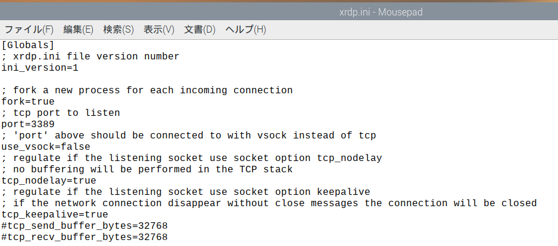
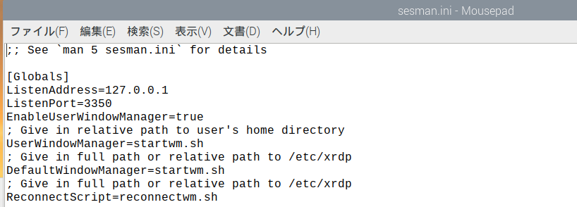
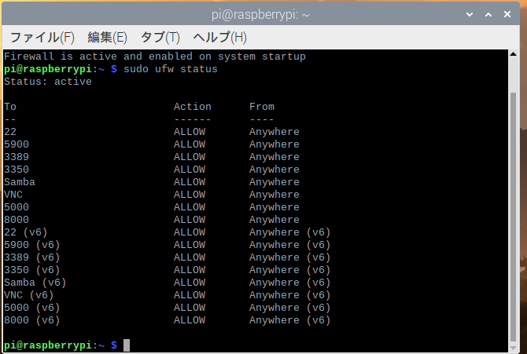

## 1よく使うコマンド、設定

共有フォルダ

```
\\192.168.*.*\share
file://192.168.100.111/share/
```

urlを打たなくてよいようにindex.htmlを用意

~~~html
<html>
  <head>
    <title>AKT Test</title>
  </head>
  <body>
    <h1>AKT Test</h1>
    <a href="/stream">動画1</a>
    <a href="/file1">動画1ファイル</a>
    <p class="news-item">
      半割ROD装置のリアルタイム動画サイトです。<br>
      動画は1分間表示されます。<br>
      １分後は再びURLをたたくと動画が再開します。<br>
      よろしくお願いします。<br>
      
  </p>
  </body>
</html>
~~~
app.pyと同じディレクトリにdist.pyを作成video以下を参照できるようにする

 dist.py
```python
# /distを静的フォルダとして定義する
from flask import Blueprint
app = Blueprint("dist", __name__,
    static_url_path='/video', static_folder='./video'
)
```

app.pyに追加video/saveを参照できるようにする

```python
# Blueprintを読み込む

import dist
app.register_blueprint(dist.app)

import glob
@app.route('/file1')
def root():
    #files=glob.glob('save/1/20200101/*')
    files=glob.glob('video/save/*')
    html='<html><meta charset="utf-8"><body>'
    html+='<h1>ファイル一覧</h1>'
    for f in files:
        html+='<p><a href="{0}">{0}</a></p>'.format(f)
    html+='</body></html>'
    return html
```

app.py

files2 = sorted(files)これがないと新しいものから消していった

app.use_reloader=False

app.run(host='192.168.100.111', port=8000,threaded=True, use_reloader=False)

・zipファイルを作るところをやめた

・ファイル一覧のところがおかしかったのでソートした

この２個がないとうまくスレッド部分が動かなかった

```python
import cv2
from flask import Flask, render_template, Response,session
import threading
import numpy as np
from PIL import Image,ImageOps
import io
import time
import datetime
import os
import shutil
from datetime import timedelta
import zipfile
import logging
from logging.handlers import TimedRotatingFileHandler

from camera import Camera

app = Flask(__name__)
#app.debug = False
app.use_reloader=False

#保存
todaydetail = datetime.datetime.today()
t1=todaydetail.strftime("%Y%m%d%H%M")
if int(t1[-1])<5:
    t2=t1[:-1]+'0'
else:
    t2=t1[:-1]+'5'
videoname=t2+'.m4v'

#(1)workディレクトリがない場合は作る
woek_path='./video/work'
if os.path.exists(woek_path)!=True:
    os.mkdir(woek_path)

#(2)workディレクトリに入っているデータはsaveへ移動最後にworkディレクトリ作成
files1 = os.listdir(woek_path)
for file in files1:
    #os.renames('../video/work/'+file,'../video/save/'+file)
    shutil.move('./video/work/'+file,'./video/save/'+file)
    if os.path.exists(woek_path)!=True:
        os.mkdir(woek_path)

fmt = cv2.VideoWriter_fourcc('m', 'p', '4', 'v')
fps = 20.0
size = (640, 360)
writer = cv2.VideoWriter('./video/work/'+videoname, fmt, fps, size)

def test():
    global t2,videoname,writer,size

    test2=Camera()
    
    while True:
        #test=Camera()
        testframe=test2.get_frame()
        #display(Image(data=testframe))
        
        testframe2 = io.BytesIO(testframe)
        testframe3=Image.open(testframe2)
        testframe4=np.asarray(testframe3)
        testframe5= cv2.cvtColor(testframe4, cv2.COLOR_RGBA2BGR)
        testframe5 = cv2.resize(testframe5, size)
        #cv2.imwrite("./video/test2.jpg",testframe4)
        writer.write(testframe5)
        #cv2.imshow('frame',testframe5)
        
        todaydetail = datetime.datetime.today()
        nametime1=todaydetail.strftime("%Y%m%d%H%M")
        if int(nametime1[-1])<5:
            nametime2=nametime1[:-1]+'0'
        else:
            nametime2=nametime1[:-1]+'5'
        #print(nametime2)
        if nametime2!=t2:
            #保存
            writer.release()
            #os.renames('../video/work/'+videoname,'../video/save/'+videoname)
            shutil.move('./video/work/'+videoname,'./video/save/'+videoname)#20210329変更
            #20210329変更
#             with zipfile.ZipFile('./video/save/'+t2+'.zip', "w", zipfile.ZIP_DEFLATED) as zf:
#                 zf.write( './video/work/'+videoname, arcname='./'+videoname)
#            os.remove('./video/work/'+videoname)
            path='./video/save/'
            files = os.listdir(path)
            files2 = sorted(files)
            MAX_CNT = 4
            for i in range(len(files)-MAX_CNT):
                    print('{}は削除します'.format(files2[i]))
                    os.remove('./video/save/'+files2[i])
            
            if os.path.exists(woek_path)!=True:
                os.mkdir(woek_path)
            fmt = cv2.VideoWriter_fourcc('m', 'p', '4', 'v')
            fps = 20.0
            size = (640, 360)
            t2=nametime2
            videoname=t2+'.m4v'
            writer = cv2.VideoWriter('./video/work/'+videoname, fmt, fps, size)
        
        if cv2.waitKey(1) & 0xFF == 13:   
            break
    writer.release()
    cv2.destroyAllWindows()

try:
    thread1 =threading.Thread(target=test)
    thread1.setDaemon(True)
    thread1.start()
except:
    writer.release()
    cv2.destroyAllWindows()

@app.route("/")
def index():
    return render_template("index.html")

@app.route("/stream")
def stream():
    return render_template("stream.html")


def gen(camera):
    test_time=time.time()
    while True:
        frame = camera.get_frame()
        test_time2=time.time()
        if test_time2-test_time>60:
            break
        if frame is not None:
            yield (b"--frame\r\n"
                b"Content-Type: image/jpeg\r\n\r\n" + frame + b"\r\n")
        else:
            print("frame is none")

@app.route("/video_feed")
def video_feed():
    return Response(gen(Camera()),
            mimetype="multipart/x-mixed-replace; boundary=frame")

# Blueprintを読み込む
import dist
app.register_blueprint(dist.app)

import glob
@app.route('/file1')
def root():
    #files=glob.glob('save/1/20200101/*')
    files=glob.glob('video/save/*')
    files2 = sorted(files)
    html='<html><meta charset="utf-8"><body>'
    html+='<h1>ファイル一覧</h1>'
    for f in files2:
        html+='<p><a href="{0}">{0}</a></p>'.format(f)
    html+='</body></html>'
    return html

if __name__ == "__main__":
    #rootロガーを取得
    logger = logging.getLogger()
    logger.setLevel(logging.DEBUG)
    #出力のフォーマットを定義
    formatter = logging.Formatter('%(asctime)s - %(levelname)s - %(message)s')
    #ファイルへ出力するハンドラーを定義
    #when='D','H','M'
    fh=logging.handlers.TimedRotatingFileHandler(filename='logs/log.txt',
                                                 when='D',
                                                 backupCount=7)
    fh.setLevel(logging.DEBUG)
    fh.setFormatter(formatter)
    #rootロガーにハンドラーを登録する
    logger.addHandler(fh)
    #app.run(host='127.0.0.1', port=8000,threaded=True)
    app.run(host='192.168.100.111', port=8000,threaded=True, use_reloader=False)
    #app.run(host='127.0.0.1', port=8000,threaded=True, use_reloader=False)
```

自動起動設定

/etc/systemd/system/内にuwsgi3.serviceファイルを作る

```
sudo nano uwsgi3.service
```

After = syslog.target

After = multi-user.targetこれでないとスレッドが動かなかった

```
[Unit]
Description = uWSGI
After = multi-user.target
[Service]
WorkingDirectory=/home/pi/flask-test3
ExecStart = /usr/local/bin/uwsgi --ini /home/pi/flask-test3/myapp.ini
User=root
Restart=always
KillSignal=SIGQUIT
Type=notify
#StandardError=syslog
NotifyAccess=all
[Install]
WantedBy=multi-user.target
```

systemctlのコマンドは以下の通り

```
$ sudo systemctl status uwsgi3 //status確認
$ sudo systemctl daemon-reload
$ sudo systemctl start uwsgi3 // uWSGI開始
$ systemctl stop uwsgi3 // uWSGI停止
$ sudo systemctl enable uwsgi3
$ sudo systemctl disable uwsgi3
```


rootのdisplayの環境変数が問題になっている？

cv2_test.py

```python
import cv2

cap = cv2.VideoCapture(0)

while( cap.isOpened() ):

    ret, frame = cap.read()
    cv2.imshow('Capture',frame)
    key = cv2.waitKey(1)
    #print( '%08X' % (key&0xFFFFFFFF) )
    if key & 0x00FF  == ord('q'):
        break

# When everything done, release the capture
cap.release()
cv2.destroyAllWindows()
```

python3  cv2_test.py

以上でpiとrootで実行してみた（sudo su)

rootでは画面表示しなかった

```bash
#!/bin/bash
export SHELL=/bin/bash
export LANGUAGE=ja_JP.UTF-8
export LANG=ja_JP.UTF-8
export LC_ALL=ja_JP.UTF-8
export PATH=/usr/local/sbin:/usr/local/bin:/usr/sbin:/usr/bin:/sbin:/bin:/usr/local/games:/usr/games

python3 /home/pi/opencv_test/cv2_test.py
```

xhost +

これで見れた。しかし、systemctlはバックグラウンドで起動になるのでいずれにしろ

disply認識しなかった。

## 有線、無線の設定

```
sudo nano /etc/dhcpcd.conf
```

```
#無線
interface wlan0
static ip_address=192.168.100.111/24
static routers=192.168.100.1
#static domain_name_servers=192.168.100.1
#有線
interface eth0
static ip_address=172.21.5.160/24
static routers=172.21.5.253
#static domain_name_servers=172.21.5.253
```


## ２ファイアウォール設定


ログイン用のポートは/etc/xrdp/xrdp.ini



画面転送用のポートは/etc/xrdp/sesman.ini



ここでリモートデスクトップのポート確認


```bash
sudo apt install ufw
sudo ufw status
sudo ufw allow 22
sudo ufw allow 5900
sudo ufw allow 3389
sudo ufw allow 3350
sudo ufw allow Samba
sudo ufw allow vnc
sudo ufw allow 5000
sudo ufw allow 8000
sudo ufw default deny  # 許可されたポート以外を閉じる
sudo ufw enable  # ufwの有効化
sudo ufw status numbered
sudo ufw app list
sudo ufw disable
```





## ３logローテーション設定設定

myapp.ini

die-on-term = trueこれがないとなぜかスレッドしか動かなかった

threads = 2これがないと動画２つ開けなかった

uwsgi.ini　変更前

```
[uwsgi]
current_release = /home/pi/flask-test3
chdir = %(current_release)
wsgi-file=%(current_release)/app.py
callable=app
#callable=logger

processes = 4
threads = 2
thunder-lock = true
max-requests = 3000
max-requests-delta = 300
master = True
workers = 1
enable-threads = true
lazy-apps = true

socket = /tmp/uwsgi.sock
chmod-socket = 666
vacuum = true
die-on-term = true
logto = /home/pi/flask-test3/logs/uWSGI-@(exec://date +%%Y-%%m-%%d).log
logfile-chmod = 644
```

uwsgi.ini　変更後logto以下を変更

```
[uwsgi]
current_release = /home/pi/flask-test3
chdir = %(current_release)
wsgi-file=%(current_release)/app.py
callable=app
#callable=logger

processes = 4
threads = 2
thunder-lock = true
max-requests = 3000
max-requests-delta = 300
master = True
workers = 1
enable-threads = true
lazy-apps = true

socket = /tmp/uwsgi.sock
chmod-socket = 666
vacuum = true
die-on-term = true
logto = /home/pi/flask-test3/logs/uwsgi.log
logfile-chmod = 644
log-master = true
log-reopen = true
touch-logreopen = /home/pi/flask-test3/logs/.logreopen_trigger
```

/usr/local/bin/uwsgi --ini  /home/pi/flask-test3/myapp.ini

/etc/logrotate.dここに記載する

```
sudo nano /etc/logrotate.d/uwsgi
```

```
/home/pi/flask-test3/logs/uwsgi.log {
        daily
        missingok
        rotate 10
        dateformat _%Y%m%d
        compress
        delaycompress
        notifempty
        create 640 root root
        sharedscripts
        postrotate
            touch /home/pi/flask-test3/logs/.logreopen_trigger
        endscript
}
```


ローテーションできなかったので設定変更

myapp.ini

```
[uwsgi]
current_release = /home/pi/flask-test3
chdir = %(current_release)
wsgi-file=%(current_release)/app.py
callable=app
#callable=logger

processes = 4
threads = 2
thunder-lock = true
max-requests = 3000
max-requests-delta = 300
master = True
workers = 1
enable-threads = true
lazy-apps = true

socket = /tmp/uwsgi.sock
chmod-socket = 666
vacuum = true
die-on-term = true
logto = /home/pi/flask-test3/logs/uwsgi.log
logfile-chown
log-master = true
log-reopen = true
touch-logreopen = /home/pi/flask-test3/logs/logreopen
```

```
sudo nano /etc/logrotate.d/uwsgi
```

```
/home/pi/flask-test3/logs/uwsgi.log {
        hourly
        missingok
        rotate 10
        compress
        delaycompress
        notifempty
        create 640 root root
        sharedscripts
        postrotate
            touch /home/pi/flask-test3/logs/logreopen
        endscript
}
```

実行してみる（動作確認）

```
sudo /usr/sbin/logrotate -d -f /etc/logrotate.d/uwsgi
```

設定反映

```
sudo /usr/sbin/logrotate /etc/logrotate.conf
```

nginxのローテートをhourlyにしてみる

```
sudo mv /etc/cron.daily/logrotate /etc/cron.hourly/
```

対象ファイルがいつローテートされたかについてはデフォルトであれば`/var/lib/logrotate.status`に記憶しており、dailyローテートの設定で1時間毎にlogrotateコマンドが実行されても、不必要にローテートする事はないため、既存のものにも影響しません。


ローテーションtest

```
sudo nano /etc/logrotate.d/new-file
```

```
/home/pi/test/info.log {
    create 644 root root
    hourly
    missingok
    rotate 240
    notifempty
    compress
    dateext
    dateformat -%Y%m%d%H
    sharedscripts
}
```

```
sudo /usr/sbin/logrotate -f /etc/logrotate.d/new-file
```

```
sudo /usr/sbin/logrotate /etc/logrotate.conf
```

これを参考に

```
sudo nano /etc/logrotate.d/uwsgi
```

```
/home/pi/flask-test3/logs/uwsgi.log {
	create 644 root root
    hourly
    missingok
    rotate 10
    notifempty
    compress
    delaycompress
    dateext
    dateformat -%Y%m%d%H
    sharedscripts
    postrotate
            touch /home/pi/flask-test3/logs/logreopen
    endscript
}
```


```
/home/pi/flask-test3/logs/uwsgi.log {
    create 644 root root
    hourly
    missingok
    rotate 10
    notifempty
    compress
    dateext
    dateformat -%Y%m%d%H
    sharedscripts
}
```

```
sudo /usr/sbin/logrotate -d -f /etc/logrotate.d/uwsgi
```

```
sudo /usr/sbin/logrotate -f /etc/logrotate.d/uwsgi
```

なぜか-dは実行できなかった

```
sudo /usr/sbin/logrotate /etc/logrotate.conf
```

```
/home/pi/flask-test3/logs/uwsgi.log {
    create 644 root root
    hourly
    missingok
    rotate 10
    notifempty
    compress
    dateext
    dateformat -%Y%m%d%H
    sharedscripts
    postrotate
            touch /home/pi/flask-test3/logs/logreopen
    endscript
}
```


```
sudo nano /etc/logrotate.d/new-file2
```

```
/home/pi/test/testlog {
	create 644 root root
	hourly
	rotate 10
	missingok
	notifempty
	dateext
    dateformat -%Y%m%d%H
	copytruncate
}
```

```
sudo /usr/sbin/logrotate -f /etc/logrotate.d/new-file2
```

どうしてもうまくいかないから

create 644 root root　だとファイルアクセスができなくなって止まってしまった。

```
/home/pi/flask-test3/logs/uwsgi.log {
    create 666 root root
    hourly
    missingok
    rotate 10
    notifempty
    compress
    dateext
    dateformat -%Y%m%d%H
    sharedscripts
    postrotate
            touch /home/pi/flask-test3/logs/logreopen
    endscript
}
```

あとはcrontabで動かす

log.sh

```
#!/bin/bash
sudo /usr/sbin/logrotate -f /etc/logrotate.d/uwsgi
```

```
 crontab -e
```

```
00 * * * * sudo bash /home/pi/flask-test3/log.sh
```

