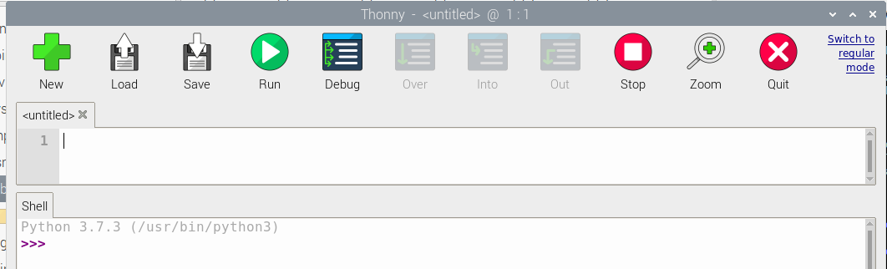
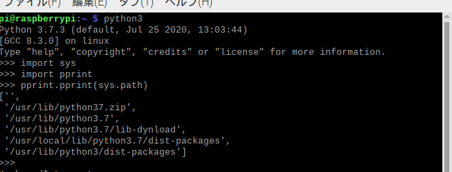
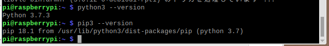
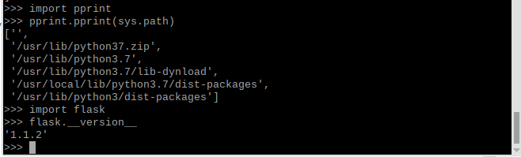

###raspios設定
raspberry pi imagerでraspios32ビット1.5Gを入れた
sshとvncは設定でOK
リモートデスクトップは下記インストール
~~~  
sudo apt-get install xrdp
~~~  
pythonの実行環境は下記を参照しているみたい  
  　
  
pythonのライブラリは下記を参照しているみたい  
  
  
アップデートや現状の環境の確認
~~~ 
sudo apt update
sudo apt upgrade
sudo apt install git
python3 --version
pip3 --version
~~~ 
  
  
必要ライブラリのインポート
~~~ 
sudo pip3 install Flask==1.1.2
sudo pip3 install　opencv-python==4.3.0.38 #うまくいかない
sudo pip3 install bokeh==0.13.0
sudo apt install libopencv-dev python3-opencv#これでうまくいった
~~~ 
  
念のためバージョン確認
~~~
import flask
import cv2
flask.__version__
cv2.__version__
~~~
  

開発環境
~~~
sudo apt install spyder3
~~~