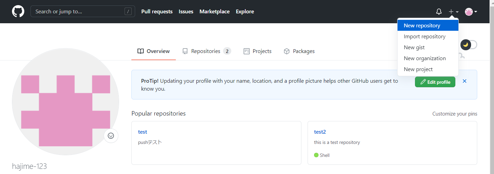
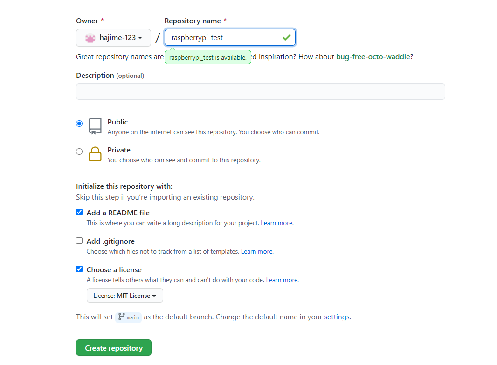
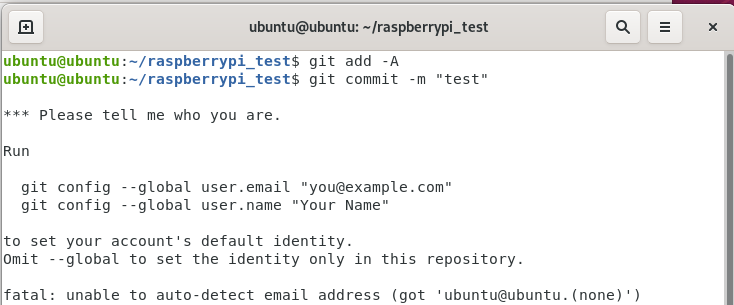

###githubの使い方
まずはrepository作成  

  

以下の設定にする  
  
ローカルレポジトリから　リモートリポジトリへ反映  

~~~  
gitbash上で作業する
cd 保存先の指定 #このディレクトリは最初空でないといけない
git clone https://github.com/hajime-123/raspberrypi_test.git 
#作成されたディレクトリの中に必要なデータを入れる
git add -A#追加下すべてを反映させるコマンド
git commit -m "raspi_test"  
git status  
commit間違えたとき
git reset HEAD
OKなら
git push
idとパスワードを求められる  
ローカルレポジトリの情報をリモートレポジトリに反映させる
~~~
リモートリポジトリからローカルリポジトリへ反映
~~~  
ラズパイで作業する
sudo apt install git
git clone https://github.com/hajime-123/raspberrypi_test.git 
~~~
コンフリクトが起きた場合
~~~  
git pull#リモートのリポジトリを持ってくる
git diff#違いを確認する
git add -A
git commit -m "test"  
git push
~~~
raspiからプッシュする為にまずは登録をしないといけない 
  

~~~  
git config --global user.email "test@yahoo.co.jp"
git config --global user.name "hajime"
git config --global core.editor vim
vim .gitconfig
~~~