#mysqlセッティング
##mysqlのインストール
C:\ProgramData\MySQL\MySQL Server 8.0\Data  
これを作成する。そうするとディレクトリを選択できる  
  
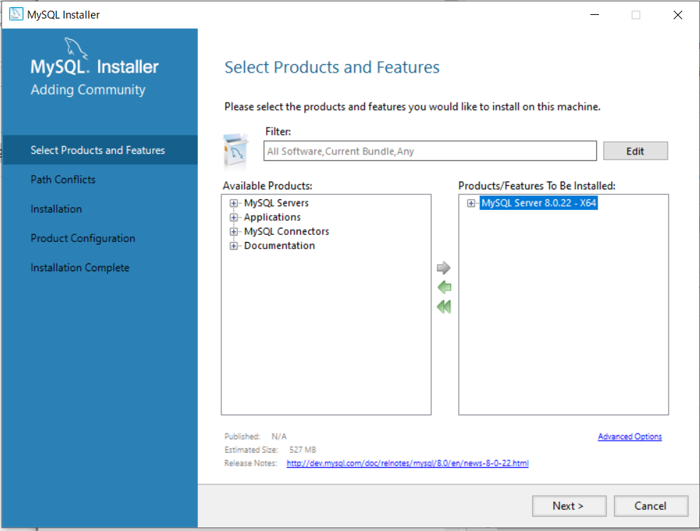  
  
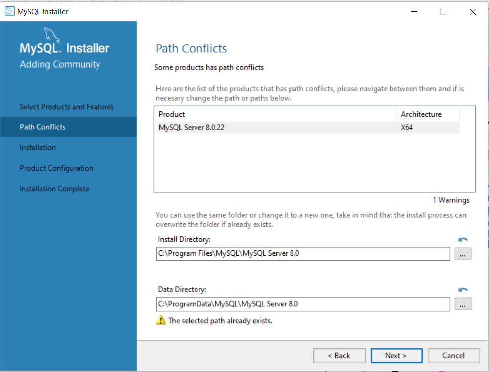  
  
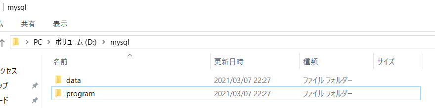  
  
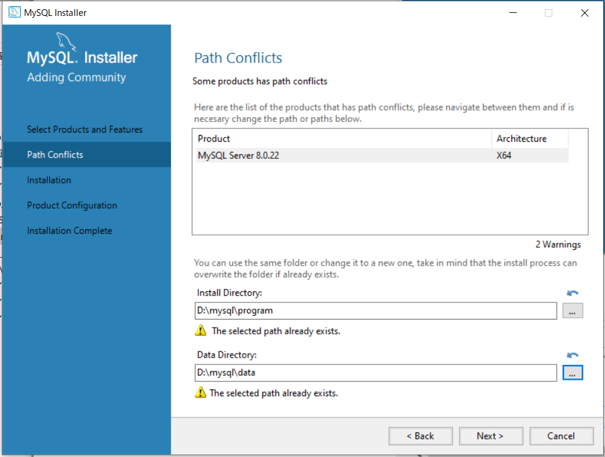  
  
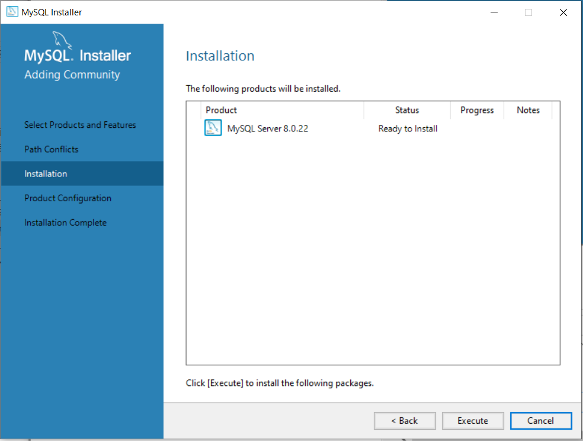  
  
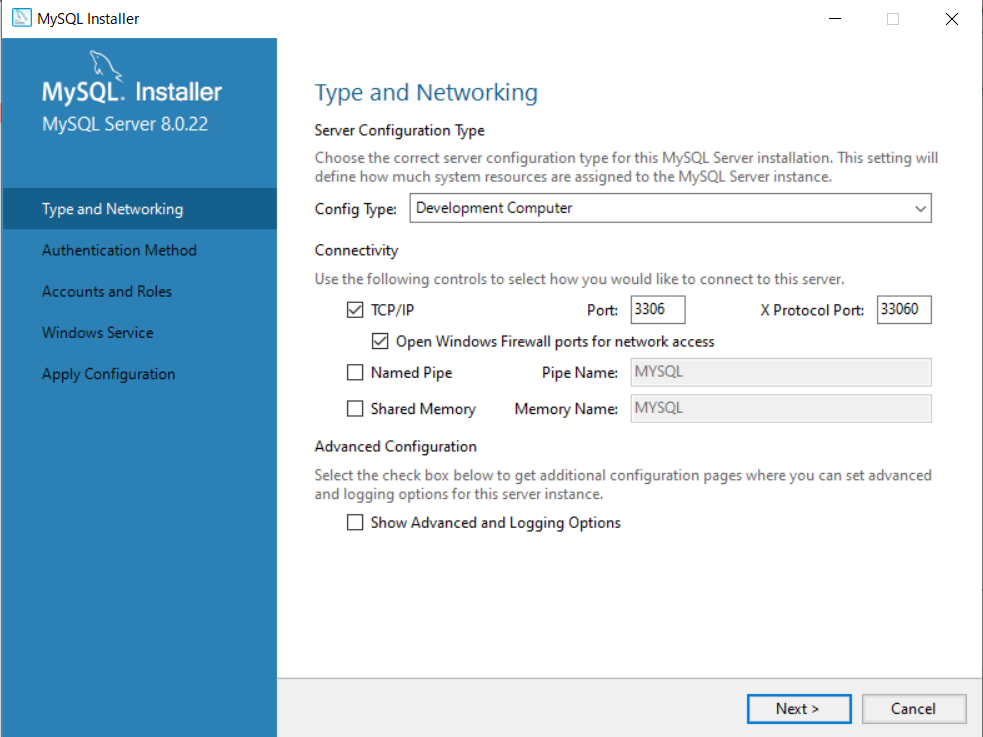  
  
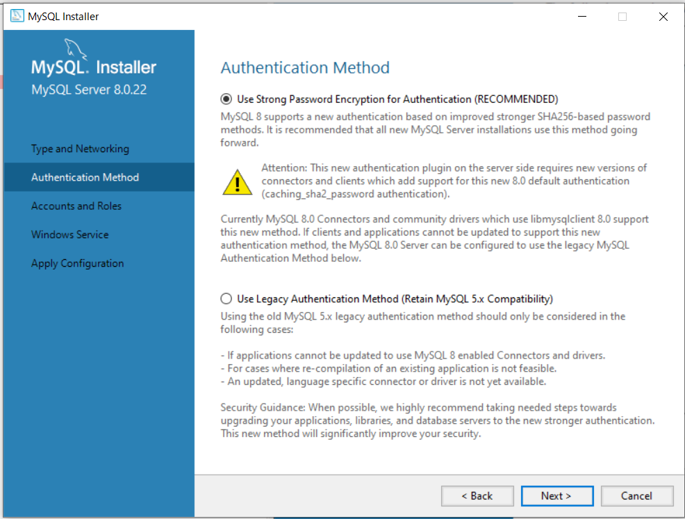  
  
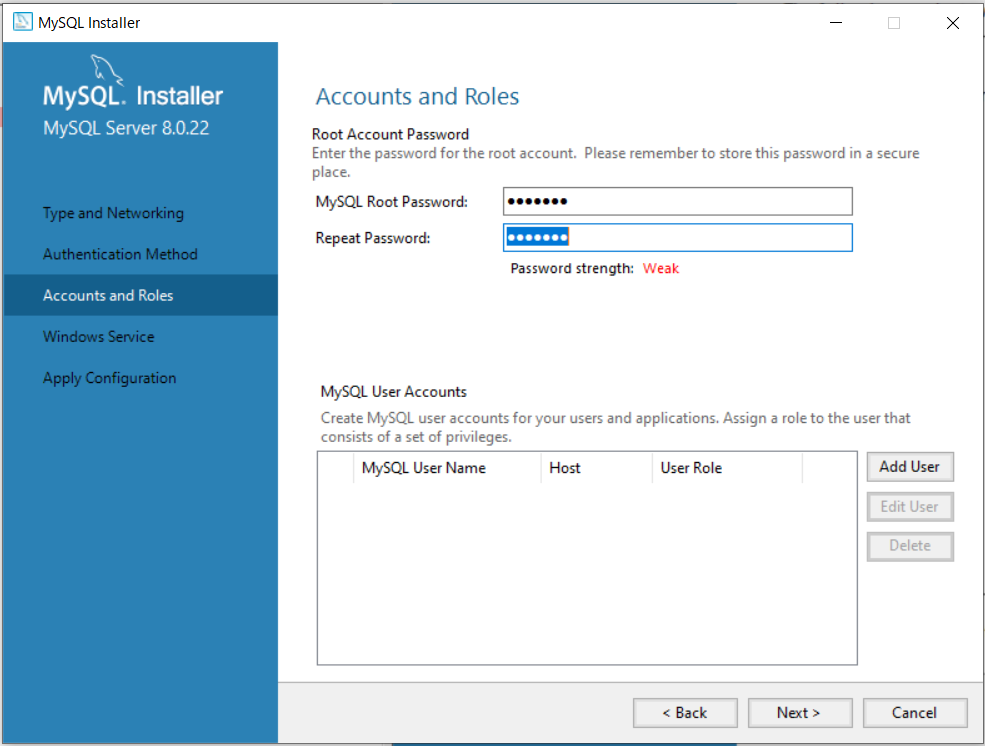  
  
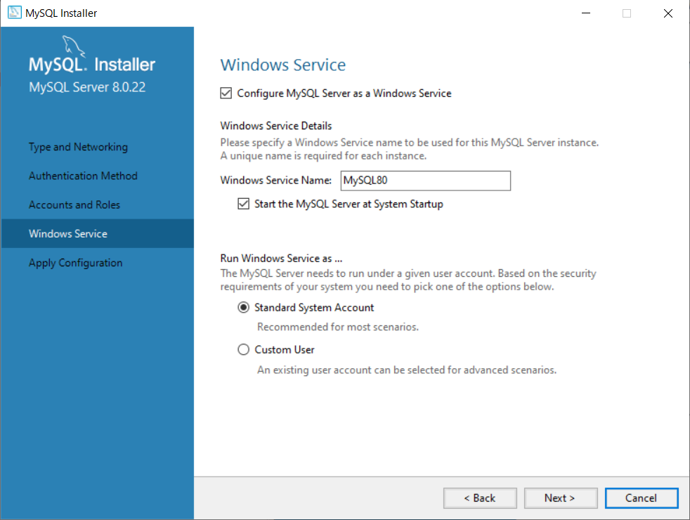  
  
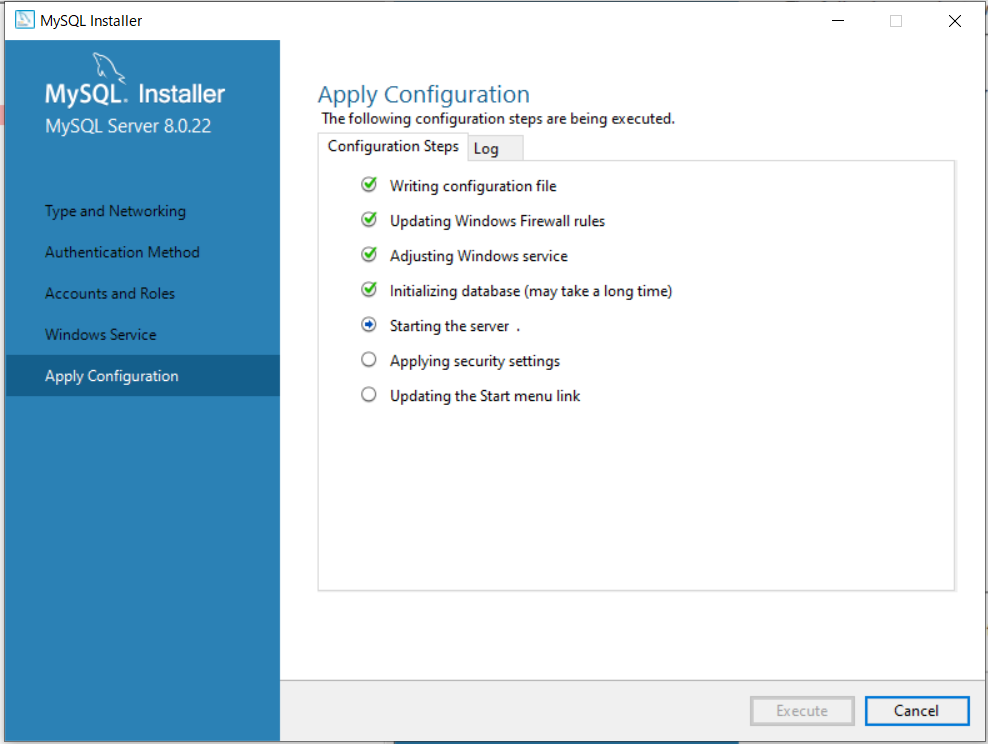  
  
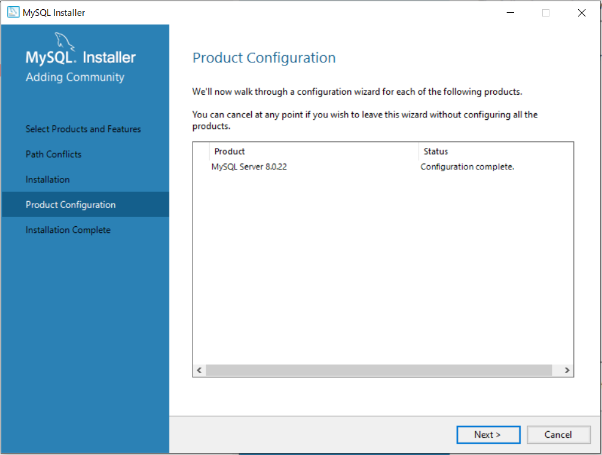  
  
##workbenchとshellも入れておく  
  
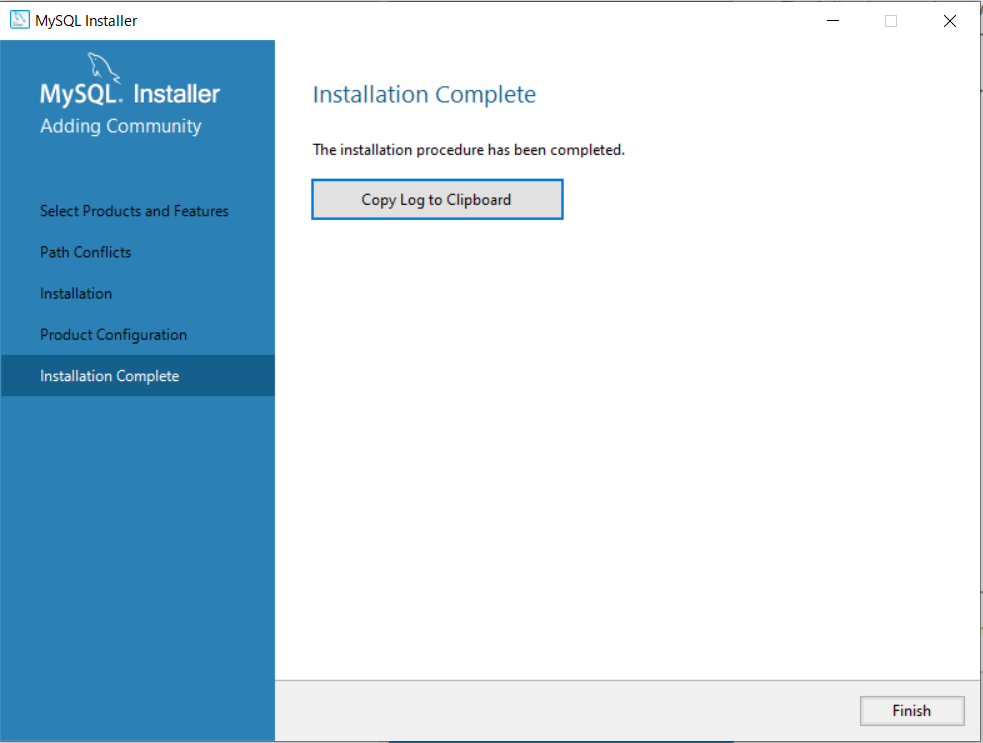  
  
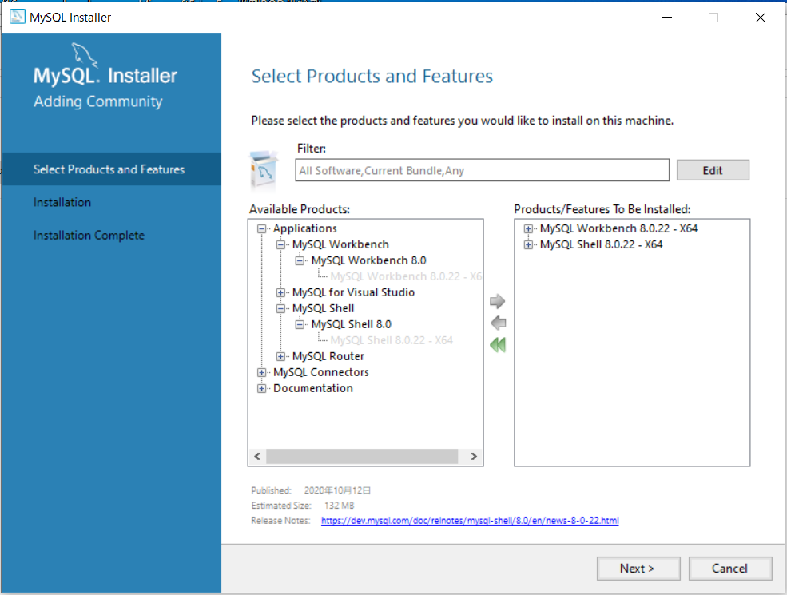  
  
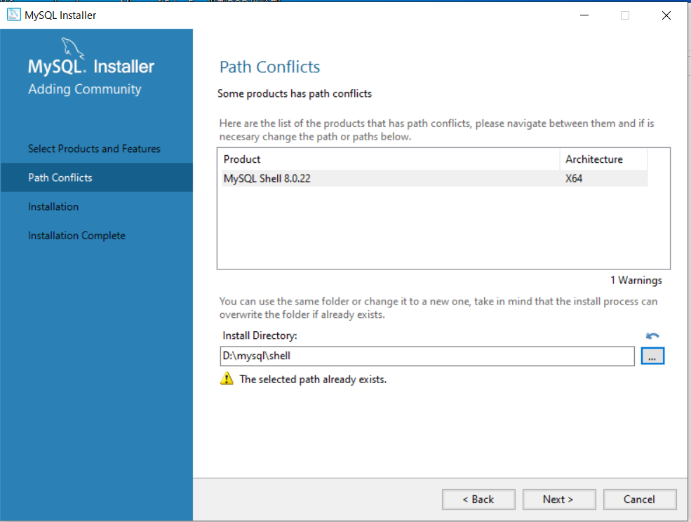  
  
##pathを通す  
  
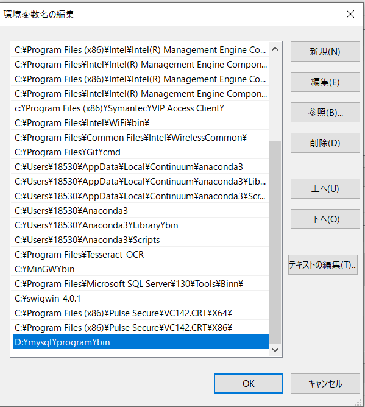  
確認　　
mysql --version

