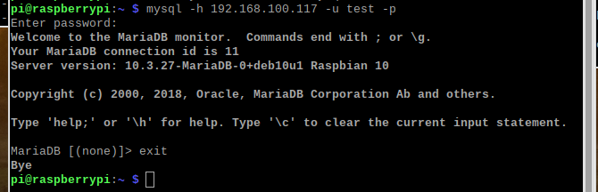
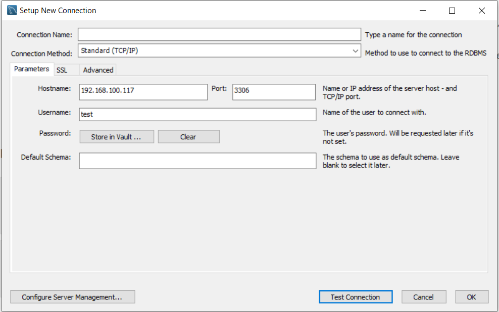
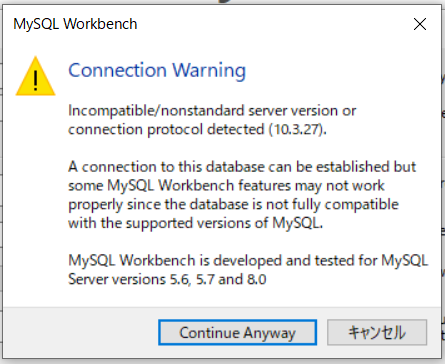
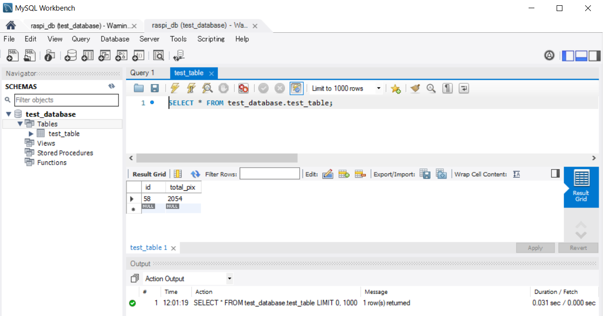

## １pythonでmysqlにデータを入れる

#### mysqlよく使うコマンド

ネットワーク経由でアクセスできるユーザーを作成する

```
grant all privileges on *.* to test@"%" identified by 'tkroyc123' with grant option;
select user,host from mysql.user;
SHOW GRANTS;
exit
sudo systemctl restart mysql
```

```
SELECT host,user,password FROM mysql.user;
```

```
mysql -h 192.168.100.117 -u test -p
```

つながらなかったのでmariadbの設定ファイルを変更する

```
sudo nano /etc/mysql/mariadb.conf.d/50-server.cnf
#bind-address         = 127.0.0.1
sudo systemctl restart mysql
```

つながった



windowsのworkbenchからもつながるか確認する。



つながるがwarningが出ている。madiadbなので仕方ないかもしれない。



テーブルの中身も確認することができた



```
show columns from test_table FROM test_database;
```

```
use test_database
alter table test_table add insert_time datetime not null after id;
alter table test_table drop insert_time;
alter table test_table modify column total_pix int(11) not null;
alter table test_table modify column total_pix int(11);
alter table test_table modify column id int(11) auto_increment;
alter table test_table change id id int(11) auto_increment;
alter table test_table change id id bigint auto_increment;
#ミリ秒まで表示できる設定にする
alter table test_table change insert_time insert_time datetime(3) not null;
desc test_table;

```


```
sudo mysql -u root -p
use test_database
select id,insert_time,total_pix from test_table;
select id,insert_time,total_pix from test_table order by id desc limit 10;
insert into test_table (insert_time, total_pix) values ('2020-04-01 08:30:00',100);
insert into test_table (insert_time, total_pix) values ('2020-04-01 08:30:00.123',100);
delete from test_table where id = 58;

```


## 3pythonでmysqlを操作する

pip3 install mysql-connector-python

mysql_test

```python
import mysql.connector as mydb

# コネクションの作成
conn = mydb.connect(
    host='127.0.0.1',
    port='3306',
    user='test',
    password='tkroyc123',
    database='test_database'
)

conn.ping(reconnect=True)
print(conn.is_connected())

cur = conn.cursor()
cur.close()
conn.close()
```

データ挿入してみる。sqlのダブルコーテーションの部分だけ注意する。

```python
import mysql.connector as mydb

# コネクションの作成
conn = mydb.connect(
    host='127.0.0.1',
    port='3306',
    user='test',
    password='tkroyc123',
    database='test_database'
)

conn.ping(reconnect=True)
print(conn.is_connected())

cur = conn.cursor()

sql ='insert into test_table (insert_time, total_pix) values ("2020-04-01 08:30:00",100)'
cur.execute(sql)
conn.commit()

cur.close()
conn.close()

```


```python
import mysql.connector as mydb
import datetime

todaydetail = datetime.datetime.today()
t1=todaydetail.strftime("%Y-%m-%d %H:%M:%S%f")
# コネクションの作成
conn = mydb.connect(
    host='127.0.0.1',
    port='3306',
    user='test',
    password='tkroyc123',
    database='test_database'
)

conn.ping(reconnect=True)
print(conn.is_connected())

cur = conn.cursor()

sql ='insert into test_table (insert_time, total_pix) values (%s, %s)'
data  =('2020-04-01 08:30:00',100)
cur.execute(sql,data)
conn.commit()

cur.close()
conn.close()
```

ミリ秒まで送ってみた

```python
import mysql.connector as mydb
import datetime

todaydetail = datetime.datetime.today()
t1=todaydetail.strftime("%Y-%m-%d %H:%M:%S.%f")
# コネクションの作成
conn = mydb.connect(
    host='127.0.0.1',
    port='3306',
    user='test',
    password='tkroyc123',
    database='test_database'
)

conn.ping(reconnect=True)
print(conn.is_connected())

cur = conn.cursor()

sql ='insert into test_table (insert_time, total_pix) values (%s, %s)'
data  =(str(t1),100)
cur.execute(sql,data)
conn.commit()

cur.close()
conn.close()
```

エラー処理も入れてみた

```python
import mysql.connector as mydb
import datetime

todaydetail = datetime.datetime.today()
t1=todaydetail.strftime("%Y-%m-%d %H:%M:%S.%f")
try:
    # コネクションの作成
    conn = mydb.connect(
        host='127.0.0.1',
        port='3306',
        user='test',
        password='tkroyc123',
        database='test_database',
        connect_timeout=1000
    )
    # 接続が切れた場合に自動的に再接続する
    conn.ping(reconnect=True)
    #print(conn.is_connected())

    cur = conn.cursor()

    sql ='insert into test_table (insert_time, total_pix) values (%s, %s)'
    data  =(str(t1),100)
    cur.execute(sql,data)
except MySQLdb.Error as e:
    print('MySQLdb.Error: ', e)
    cur.close()
    conn.close()
finally:
    cur.close()
    

conn.commit()

cur.close()
conn.close()
```

時間測定

```python
import mysql.connector as mydb
import datetime
import time

# コネクションの作成
conn = mydb.connect(
    host='127.0.0.1',
    port='3306',
    user='test',
    password='tkroyc123',
    database='test_database',
    connect_timeout=1000
)    
# 接続が切れた場合に自動的に再接続する
conn.ping(reconnect=True)
#print(conn.is_connected())

for i in range(5):
    start_time = time.perf_counter() * 1000
    todaydetail = datetime.datetime.today()
    t1=todaydetail.strftime("%Y-%m-%d %H:%M:%S.%f")
    try:
        
        cur = conn.cursor()
        sql ='insert into test_table (insert_time, total_pix) values (%s, %s)'
        data  =(str(t1),100)
        cur.execute(sql,data)
    except MySQLdb.Error as e:
        print('MySQLdb.Error: ', e)
        cur.close()
        conn.close()
    finally:
        cur.close()
        
    conn.commit()

    cur.close()
    #conn.close()

    end_time = time.perf_counter() * 1000
    print(end_time-start_time)
```

ログも残すようにする

```python
import mysql.connector as mydb
import datetime
import time
import logging
from logging.handlers import TimedRotatingFileHandler
import sys

#--------------------------
#rootロガーを取得
logger = logging.getLogger()
logger.setLevel(logging.DEBUG)
#出力のフォーマットを定義
formatter = logging.Formatter('%(asctime)s - %(levelname)s - %(message)s')
#ファイルへ出力するハンドラーを定義
#when='D','H','M'
fh=logging.handlers.TimedRotatingFileHandler(filename='logs/mysqllog.txt',
                                             when='H',
                                             backupCount=7)
fh.setLevel(logging.DEBUG)
fh.setFormatter(formatter)
#rootロガーにハンドラーを登録する
logger.addHandler(fh)
logger.debug('ロギング 開始')
#--------------------------

# コネクションの作成
conn = mydb.connect(
    host='127.0.0.1',
    port='3306',
    user='test',
    password='tkroyc123',
    database='test_database',
    connect_timeout=1000
)    
# 接続が切れた場合に自動的に再接続する
conn.ping(reconnect=True)
#print(conn.is_connected())

for i in range(5):
    start_time = time.perf_counter() * 1000
    todaydetail = datetime.datetime.today()
    t1=todaydetail.strftime("%Y-%m-%d %H:%M:%S.%f")
    try:
        
        cur = conn.cursor()
        sql ='insert into test_table (insert_time, total_pix) values (%s, %s)'
        data  =(str(t1),100)
        cur.execute(sql,data)
    except MySQLdb.Error as e:
        logger.info('MySQLdb.Error: ', e)
        cur.close()
        conn.close()
    finally:
        cur.close()
        
    conn.commit()

    cur.close()
    #conn.close()

    end_time = time.perf_counter() * 1000
    logger.info(end_time-start_time)
```

画像の取得のプログラム

```python
import cv2
import datetime

URL ="http://192.168.100.117:8080/?action=stream"
cap = cv2.VideoCapture(URL)

while True:
    ret, img = cap.read()
    cv2.imshow("WebCamera form Raspberry pi",img)
    k = cv2.waitKey(1)
    if k == ord('p'): #Esc入力時は終了
        date=datetime.datetime.today().strftime('%Y-%m-%d_%H:%M:%S.%f')
        path='./img/'+date+'.png'
        cv2,imwrite(path,img)
        print(img.shape)
        cv2.imshow(path,img)
    elif k==ord('q'):
        break
cap.release()
cv2.destroyAllWindows()

(480, 640, 3)

```

画像のピクセルの値をすべて足すプログラム

```python
import cv2
import datetime
import time
import numpy as np

#path='./img/2021-04-12_08:18:21.572808.png'
path='./img/2021-04-12_09:24:47.509665.png'
img= cv2.imread(path)

# グレースケール変換   
gray = cv2.cvtColor(img, cv2.COLOR_BGR2GRAY)

total=np.sum(gray)

```

１秒に一回ピクセルの総数をprintするプログラム

```python
import cv2
import datetime
import time

URL ="http://192.168.100.117:8080/?action=stream"
cap = cv2.VideoCapture(URL)

while True:
    start_time = time.perf_counter()
    ret, img = cap.read()
    print(img.shape)
    k = cv2.waitKey(1)
    time.sleep(1)
    end_time = time.perf_counter()
    print(end_time-start_time)
    if k==ord('q'):
        break
cap.release()
cv2.destroyAllWindows()
```

DBにコネクションを切らずにインサートし、途中でセレクトをするとどうなるかを確認する

```python
import mysql.connector as mydb
import datetime
import time
import logging
from logging.handlers import TimedRotatingFileHandler
import sys

#--------------------------
#rootロガーを取得
logger = logging.getLogger()
logger.setLevel(logging.DEBUG)
#出力のフォーマットを定義
formatter = logging.Formatter('%(asctime)s - %(levelname)s - %(message)s')
#ファイルへ出力するハンドラーを定義
#when='D','H','M'
fh=logging.handlers.TimedRotatingFileHandler(filename='logs/mysqllog.txt',
                                             when='H',
                                             backupCount=7)
fh.setLevel(logging.DEBUG)
fh.setFormatter(formatter)
#rootロガーにハンドラーを登録する
logger.addHandler(fh)
logger.debug('ロギング 開始')
#--------------------------

# コネクションの作成
conn = mydb.connect(
    host='127.0.0.1',
    port='3306',
    user='test',
    password='tkroyc123',
    database='test_database',
    connect_timeout=1000
)    
# 接続が切れた場合に自動的に再接続する
conn.ping(reconnect=True)
#print(conn.is_connected())

while True:
    start_time = time.perf_counter() * 1000
    todaydetail = datetime.datetime.today()
    t1=todaydetail.strftime("%Y-%m-%d %H:%M:%S.%f")
    try:
        
        cur = conn.cursor()
        sql ='insert into test_table (insert_time, total_pix) values (%s, %s)'
        data  =(str(t1),100)
        cur.execute(sql,data)
    except MySQLdb.Error as e:
        logger.info('MySQLdb.Error: ', e)
        cur.close()
        conn.close()
    finally:
        cur.close()
        
    conn.commit()

    cur.close()
    #conn.close()

    end_time = time.perf_counter() * 1000
    logger.info(end_time-start_time)
```

