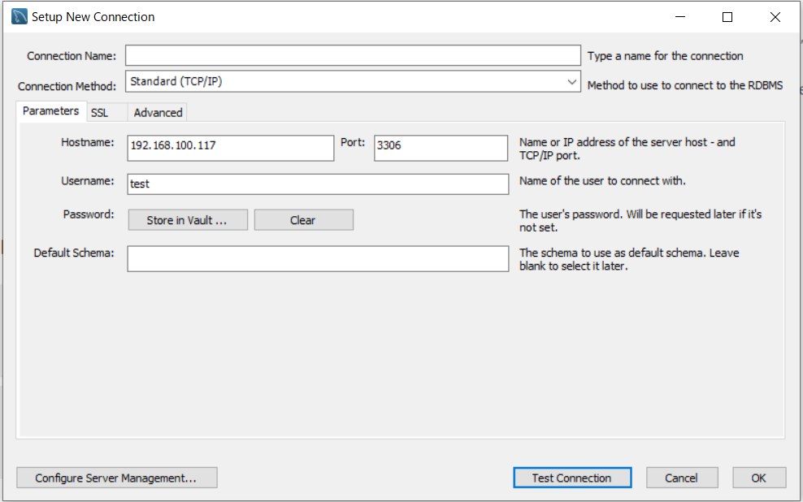
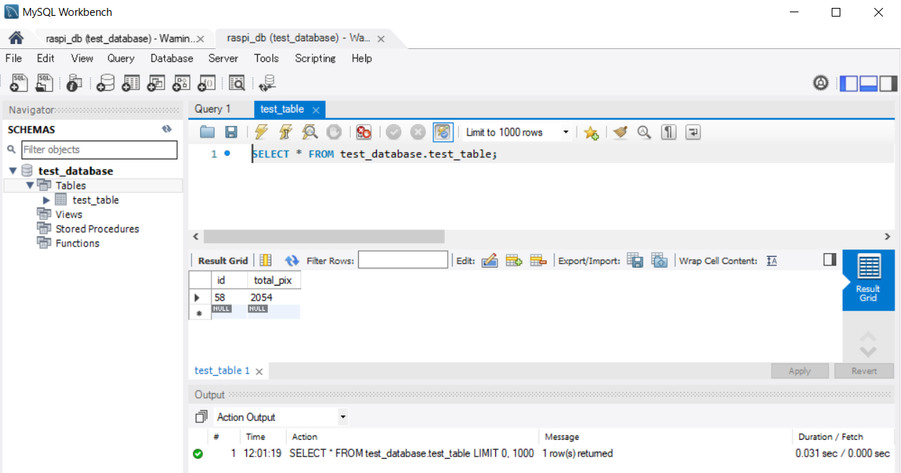
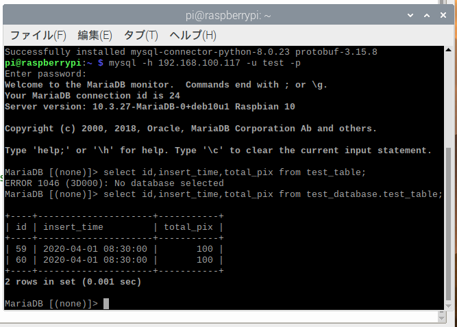

## １mysqlセットアップを行う

##### MySQLサーバとクライアントツールのインストール

```
sudo apt install mysql-server mysql-client
```

実行できなかった

mariadb-server-10.0

mariadb-client-10.0

代わりに上記ならインストールできるみたい

```
sudo apt-get install mariadb-server mariadb-client
```

インストールしたらバージョン確認

```
mysql --version
```

mysql  Ver 15.1 Distrib 10.3.27-MariaDB, for debian-linux-gnueabihf (armv8l) using readline 5.2

サービスの起動確認

```
sudo service mysql status
```


##### rootユーザーの設定

```
sudo mysql_secure_installation
```

とりあえず今はパスワードないのでenter


#Set root password? [Y/n] 

y パスワード設定します

#Remove anonymous users? [Y/n] 

y

#Disallow root login remotely? [Y/n] リモート接続にはnoにしないといけないのでは？

y

#Remove test database and access to it? [Y/n] 

y

#Reload privilege tables now? [Y/n] 

y

とりあえずパスワードの設定だけ行った


MySQLにログイン

```
sudo mysql -u root
```

データベース一覧表示

```
show databases;
```


テストデータベース作成

```
create database test_database; 
```

テストデータベースにテストテーブル作成

```
create table test_database.test_table (id int, total_pix int, primary key (id)); 
```

使用するDBに移動

```
use test_database
```

テストテーブルにデータ投入

```
insert into test_database.test_table(id, total_pix) values(58, 2054); #DBに移動してない時
insert into test_table(id, total_pix) values(58, 2054); 
```

テストテーブル表示

```
select * from test_database.test_table;
```

テストデータベース削除

```
drop database test_database;
```

ログアウト

```
exit
```

## 2windowPCからラズパイに接続する


```sh
show variables like 'port'
```


```
sudo apt install ufw
sudo ufw status
sudo ufw allow 22
sudo ufw allow 5900
sudo ufw allow 3389
sudo ufw allow 3350
sudo ufw allow Samba
sudo ufw allow vnc
sudo ufw allow 5000
sudo ufw allow 8000
sudo ufw allow 8080
sudo ufw allow 8081
sudo ufw allow 3306
sudo ufw default deny  # 許可されたポート以外を閉じる
sudo ufw enable  # ufwの有効化
sudo ufw status numbered
sudo ufw app list
sudo ufw disable
```


秘密鍵、公開鍵でのSSH

teratermで作成


所定のフォルダに公開鍵保存


秘密鍵も保存


公開鍵をサーバーへ設置

まずはteratermでログインする。

ファイルメニューより「**SSH SCP**」を選択します。


先程保存したid_rsa.pubを選択する。


サーバ側に公開鍵が保存された

公開鍵で接続できるようにする

サーバーに接続状態で

```
mkdir .ssh
chmod 700 .ssh
mv id_rsa.pub .ssh/authorized_keys
#確認
ls -la
cd .ssh
ls -l
```


なぜか上記のディレクトリに置かないと接続できなかった？


切側することができた


```
~/.ssh/authorized_keys
```


うまくいかなかったのでPuTTYを入れてみる


保存先


```
sudo mysql -u root
USE mysql;
UPDATE user SET plugin='' WHERE User='root';
exit
sudo systemctl restart mysql

mysql -u root
update mysql.user set password=password('tkroyc123') where user = 'root';
exit
sudo systemctl restart mysql
mysql -u root -p
```

これでもうまくいかなかった。

ネットワーク経由でアクセスできるユーザーを作成する

```
grant all privileges on *.* to test@"%" identified by 'tkroyc123' with grant option;
select user,host from mysql.user;
SHOW GRANTS;
exit
sudo systemctl restart mysql
```

```
SELECT host,user,password FROM mysql.user;
```

```
mysql -h 192.168.100.117 -u test -p
```

つながらなかったのでmariadbの設定ファイルを変更する

```
sudo nano /etc/mysql/mariadb.conf.d/50-server.cnf
#bind-address         = 127.0.0.1
sudo systemctl restart mysql
```

つながった


windowsのworkbenchからもつながるか確認する。



つながるがwarningが出ている。madiadbなので仕方ないかもしれない。


テーブルの中身も確認することができた



```
show columns from test_table FROM test_database;
```

```
use test_database
alter table test_table add insert_time datetime not null after id;
alter table test_table drop insert_time;
alter table test_table modify column total_pix int(11) not null;
alter table test_table modify column total_pix int(11);
alter table test_table modify column id int(11) auto_increment;
alter table test_table change id id int(11) auto_increment;
alter table test_table change id id bigint auto_increment;
desc test_table;

```


```
select id,insert_time,total_pix from test_table;
insert into test_table (insert_time, total_pix) values ('2020-04-01 08:30:00',100);
delete from test_table where id = 58;
```


## 3pythonでmysqlを操作する

pip3 install mysql-connector-python

mysql_test

```python
import mysql.connector as mydb

# コネクションの作成
conn = mydb.connect(
    host='127.0.0.1',
    port='3306',
    user='test',
    password='tkroyc123',
    database='test_database'
)

conn.ping(reconnect=True)
print(conn.is_connected())

cur = conn.cursor()
cur.close()
conn.close()
```

データ挿入してみる。sqlのダブルコーテーションの部分だけ注意する。

```python
import mysql.connector as mydb

# コネクションの作成
conn = mydb.connect(
    host='127.0.0.1',
    port='3306',
    user='test',
    password='tkroyc123',
    database='test_database'
)

conn.ping(reconnect=True)
print(conn.is_connected())

cur = conn.cursor()

sql ='insert into test_table (insert_time, total_pix) values ("2020-04-01 08:30:00",100)'
cur.execute(sql)
conn.commit()

cur.close()
conn.close()

```


